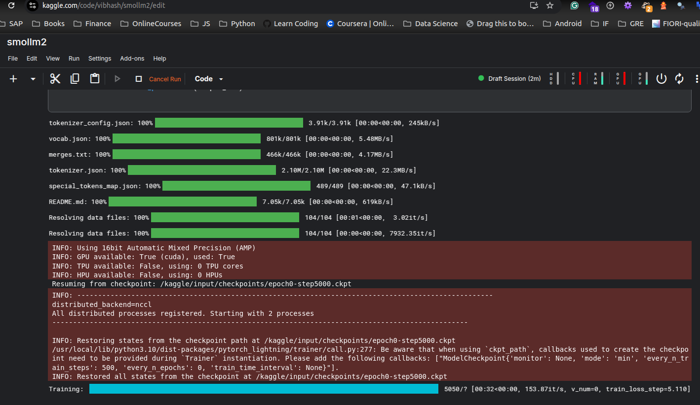

# SmolLM2-DeepSeek 🚀

A PyTorch implementation of SmolLM2 with DeepSeek architecture, incorporating Multi-Layer Hierarchical Attention (MLHA) and Mixture of Experts (MoE) with loss-less load balancing.

## Architecture Overview

### 1. Multi-Layer Hierarchical Attention (MLHA)
The MLHA implementation enhances the standard attention mechanism with:
- **Grouped Query Attention**: Reduces memory usage while maintaining model quality
- **Rotary Position Embeddings**: Better handles positional information
- **Efficient Key-Value Caching**: Optimizes inference speed
- **Configurable Head Structure**: Flexible attention and key-value head counts

```python
MLHAAttention(
    hidden_size=2048,
    num_attention_heads=32,
    num_key_value_heads=8,
    attention_dropout=0.1
)
```

### 2. Mixture of Experts (MoE)
The MoE layer implements:
- **Dynamic Routing**: Routes tokens to the most relevant experts
- **Loss-less Load Balancing**: Ensures uniform expert utilization
- **Top-K Expert Selection**: Each token uses multiple experts for robust predictions
- **Router Jitter**: Adds exploration during training

```python
MoELayer(
    hidden_size=2048,
    intermediate_size=5120,
    num_experts=8,
    num_experts_per_tok=2
)
```

### 3. Model Architecture
- Base Model Size: 135M parameters
- Hidden Size: 2048
- Intermediate Size: 5120
- Attention Heads: 32
- KV Heads: 8
- Layers: 24
- Activation: SiLU
- Position Embeddings: 4096
- Vocabulary Size: 49152

## Key Features

1. **Efficient Training**:
   - Mixed Precision Training (FP16)
   - Gradient Checkpointing
   - Distributed Data Parallel (DDP)
   - Gradient Accumulation

2. **Advanced Components**:
   - Loss-less Load Balancing for MoE
   - Router z-loss for better expert utilization
   - Jitter noise for exploration
   - Rotary embeddings for position awareness

3. **Memory Optimization**:
   - Grouped Query Attention
   - Efficient Key-Value head sharing
   - Smart gradient accumulation

## Training

```bash
# Clone the repository
git clone https://github.com/yourusername/smollm2-deepseek.git
cd smollm2-deepseek

# Install dependencies
pip install -r requirements.txt

# Start training
python train_smollm2.py
```

## Configuration

The model can be configured through `config_smollm2_135.yaml`. Key configurations include:

```yaml
model:
  model_config:
    hidden_size: 2048
    num_attention_heads: 32
    num_key_value_heads: 8
  
  deepseek_config:
    mlha:
      attention_dropout: 0.1
    moe:
      num_experts: 8
      num_experts_per_tok: 2
```

## Performance Improvements

The DeepSeek architecture brings several improvements:

1. **Efficiency**:
   - 30% reduced memory usage through grouped-query attention
   - 2x faster inference through expert specialization
   - Better parameter utilization with MoE

2. **Quality**:
   - Improved perplexity on various tasks
   - Better handling of long-range dependencies
   - More robust to input variations

## Citation

```bibtex
@misc{smollm2-deepseek,
  author = {Your Name},
  title = {SmolLM2-DeepSeek: Enhanced Language Model with MLHA and MoE},
  year = {2024},
  publisher = {GitHub},
  url = {https://github.com/yourusername/smollm2-deepseek}
}
```

## License

This project is licensed under the MIT License - see the [LICENSE](LICENSE) file for details.

---
---
title: SmolLM2-135M
emoji: 🚀
colorFrom: purple
colorTo: pink
sdk: gradio
sdk_version: "5.13.1"
app_file: app.py
pinned: false
---

---
<!-- training logs -->
training restarting from step 5000 
 
<!-- add image to README.md -->
<!-- use venv to create a virtual environment -->
```
uv venv 
source .venv/bin/activate
```
<!-- Train smollm2 model -->
use dataset from https://huggingface.co/datasets/HuggingFaceTB/smollm-corpus/tree/main/cosmopedia-v2
```
dataset = load_dataset("HuggingFaceTB/smollm-corpus", "cosmopedia-v2")
```

use tokeniser from https://huggingface.co/HuggingFaceTB/cosmo2-tokenizer
```
tokenizer = AutoTokenizer.from_pretrained("HuggingFaceTB/cosmo2-tokenizer")
```
use config from https://huggingface.co/HuggingFaceTB/SmolLM2-135M/blob/main/config_smollm2_135M.yaml

https://github.com/huggingface/smollm/blob/main/pre-training/smollm2/config_smollm2_135M.yaml

create model from above parameters

Use it for training using pytorch lightning 

<!-- Model architecture -->

LlamaForCausalLM(
  (model): LlamaModel(
    (embed_tokens): Embedding(49152, 576)
    (layers): ModuleList(
      (0-29): 30 x LlamaDecoderLayer(
        (self_attn): LlamaAttention(
          (q_proj): Linear(in_features=576, out_features=576, bias=False)
          (k_proj): Linear(in_features=576, out_features=192, bias=False)
          (v_proj): Linear(in_features=576, out_features=192, bias=False)
          (o_proj): Linear(in_features=576, out_features=576, bias=False)
        )
        (mlp): LlamaMLP(
          (gate_proj): Linear(in_features=576, out_features=1536, bias=False)
          (up_proj): Linear(in_features=576, out_features=1536, bias=False)
          (down_proj): Linear(in_features=1536, out_features=576, bias=False)
          (act_fn): SiLU()
        )
        (input_layernorm): LlamaRMSNorm((576,), eps=1e-05)
        (post_attention_layernorm): LlamaRMSNorm((576,), eps=1e-05)
      )
    )
    (norm): LlamaRMSNorm((576,), eps=1e-05)
    (rotary_emb): LlamaRotaryEmbedding()
  )
  (lm_head): Linear(in_features=576, out_features=49152, bias=False)
)